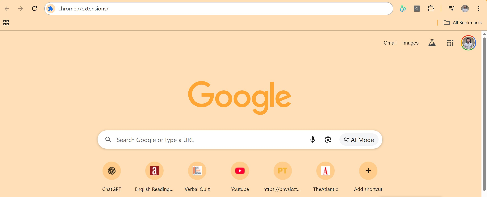
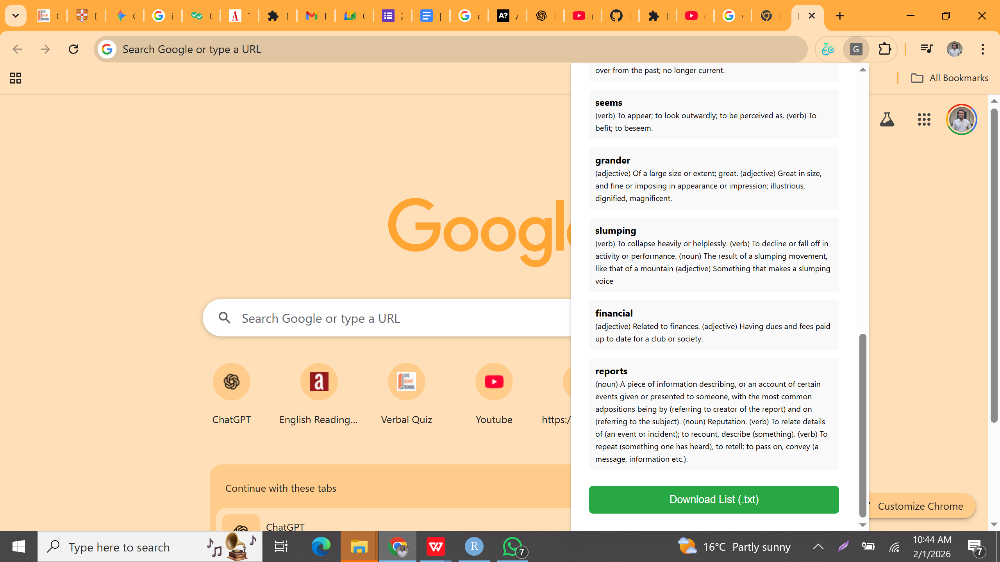

# GRE-Vocab-Downloader

A lightweight Chrome Extension designed to streamline GRE vocabulary collection and management directly from your browser. Developed as part of a graduate research and preparation toolset.

---

## 🛠️ How to Install and Use
Follow these steps to set up the extension on your Google Chrome browser:

### **Step 1: Download the Extension**
* Download this repository as a ZIP file by clicking the green **Code** button at the top of this page.
* Extract the ZIP file into a local folder (e.g., your Desktop or a Projects folder).

### **Step 2: Access Chrome Extensions**
* Open Google Chrome and type `chrome://extensions/` in the address bar.
* Alternatively, go to **Settings** > **Extensions** > **Manage Extensions**.

### **Step 3: Enable Developer Mode**
* In the top-right corner, toggle the **Developer mode** switch to **ON**.

### **Step 4: Load the Extension**
* Click the **Load unpacked** button in the top-left corner.
* Select the folder where you extracted the project files (ensure all `.js`, `.html`, and `.json` files are in this single folder).

### **Step 5: Use the Extension**
* Click the **Puzzle Piece** icon in your toolbar and **Pin** the GRE-Vocab-Downloader.
* Use the popup interface or the integrated side panel to start managing your vocabulary.

---

## 📄 Vocabulary Export Feature
The extension includes a built-in utility to help you study offline or import your data into other tools.

* **Text File Download**: Users can export their collected vocabulary list directly as a formatted `.txt` file for easy review.
* **One-Click Export**: Simply click the **"Download List (.txt)"** button at the bottom of the extension interface to save your progress locally.

---

## 📂 Project Structure
* **manifest.json**: Extension configuration and permissions.
* **background.js**: Manages background tasks and download logic.
* **popup.js & sidepanel.js**: UI logic for quick access and navigation.
* **Technical Stack**: Developed using JavaScript (ES6+), HTML5, and CSS3.

---

## 👤 Author
**Md Soumike Hassan** | Data Scientist | [cite_start]MS in Statistics and Data Science [cite: 1, 6, 8]  
* [cite_start]**Research Interests**: Computer Vision, Explainable AI (XAI), and Medical AI [cite: 53, 55, 57]
* [cite_start]**LinkedIn**: [Your Profile Link Here] [cite: 2]
